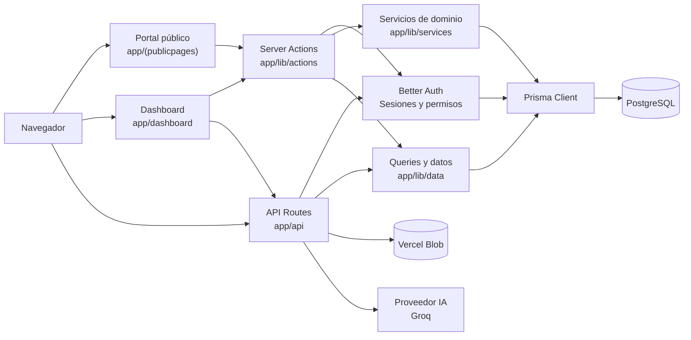
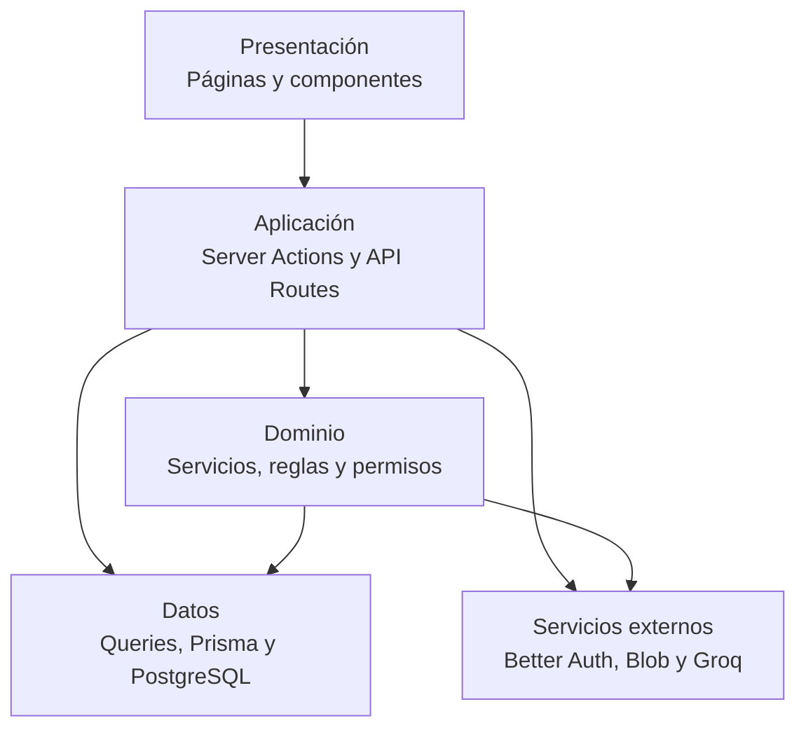

# Arquitectura y estructura

## Resumen

Adoptame es una aplicación web monolítica modular basada en Next.js App
Router. La interfaz pública permite consultar animales y enviar solicitudes de
adopción. El dashboard protege las operaciones internas mediante Better Auth,
roles y permisos.

La persistencia principal está en PostgreSQL mediante Prisma. Las imágenes se
almacenan en Vercel Blob y el asistente de IA consulta datos del refugio a
través de proyecciones controladas.

## Diagrama general



## Capas del proyecto



## Estructura de carpetas

```text
app/
├── (publicpages)/       Portal público y autenticación
├── api/                 Endpoints HTTP
├── dashboard/           Operaciones del personal y usuarios
├── lib/
│   ├── actions/         Mutaciones con Server Actions
│   ├── ai/              Contexto, herramientas y aprobación de IA
│   ├── auth/            Sesión, roles y permisos
│   ├── data/            Consultas y lecturas de aplicación
│   ├── services/        Reglas de dominio y transacciones
│   └── zod-schemas/     Validación de entrada
└── layout.tsx           Layout raíz y metadata

components/
├── auth/                Formularios y controles de autenticación
├── dashboard/           Widgets y vistas del dashboard
├── public-pages/        Navegación y componentes públicos
├── forms/               Campos reutilizables
└── ui/                  Primitivas visuales

prisma/
├── schema.prisma        Modelo de datos
├── migrations/          Historial de cambios de esquema
├── seed.ts              Datos iniciales
└── *.test.ts            Pruebas con PostgreSQL

tests/e2e/               Pruebas de recorridos completos con Playwright
public/                  Imágenes y recursos estáticos
compose.yml              PostgreSQL para desarrollo local
```

## Módulos funcionales

| Módulo | Responsabilidad principal |
| --- | --- |
| Animales | Fichas, fotos, características, notas, tareas, vitales y actividad. |
| Ingresos | Registro, correcciones, ubicación y trazabilidad del ingreso. |
| Adopciones | Solicitudes públicas, revisión interna y resolución de resultados. |
| Fosters | Solicitudes, asignaciones, retornos y conversiones. |
| Personas | Perfiles, cuentas, hogares, notas e historial. |
| Ubicaciones | Localizaciones, unidades y ocupación actual. |
| Readiness | Evaluaciones y bloqueos para determinar preparación de adopción. |
| Reportes | Ingresos, resultados y permanencia de animales. |
| IA | Consultas sobre datos y cambios de tareas con aprobación explícita. |

## Persistencia y seguridad

- PostgreSQL es la fuente de verdad de usuarios, animales, solicitudes,
  actividad y configuración del refugio.
- Prisma centraliza el acceso tipado y las transacciones.
- Better Auth administra sesiones, credenciales y OAuth.
- Las acciones sensibles verifican permisos antes de modificar datos.
- Las operaciones de negocio que afectan varias entidades se ejecutan dentro
  de transacciones.
- Los eventos y notas conservan trazabilidad de cambios importantes.
