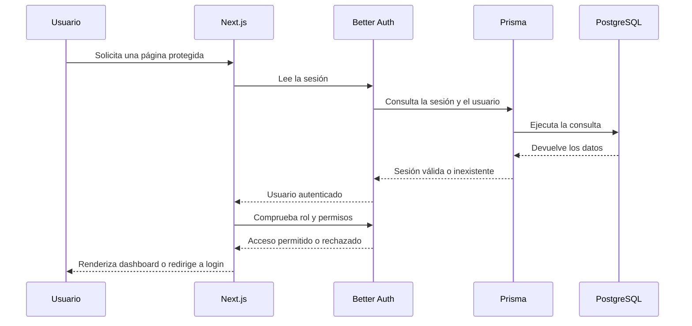
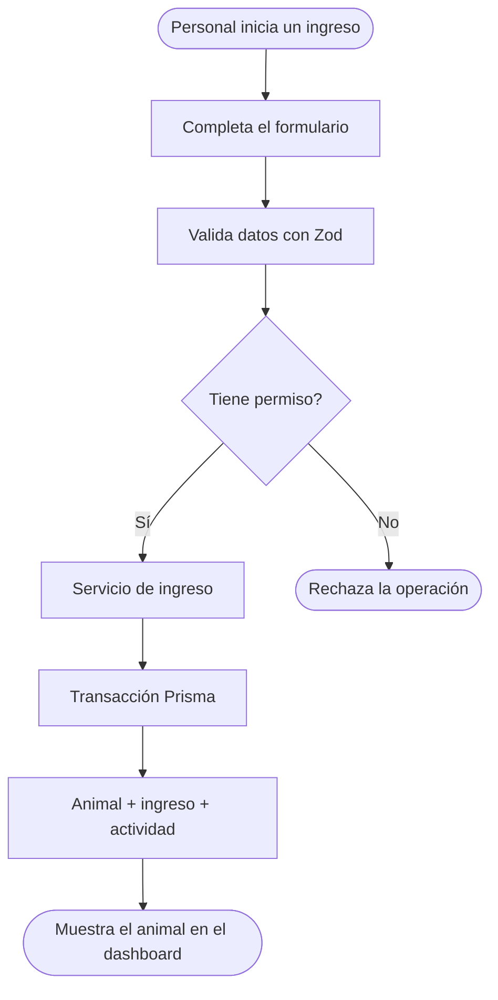
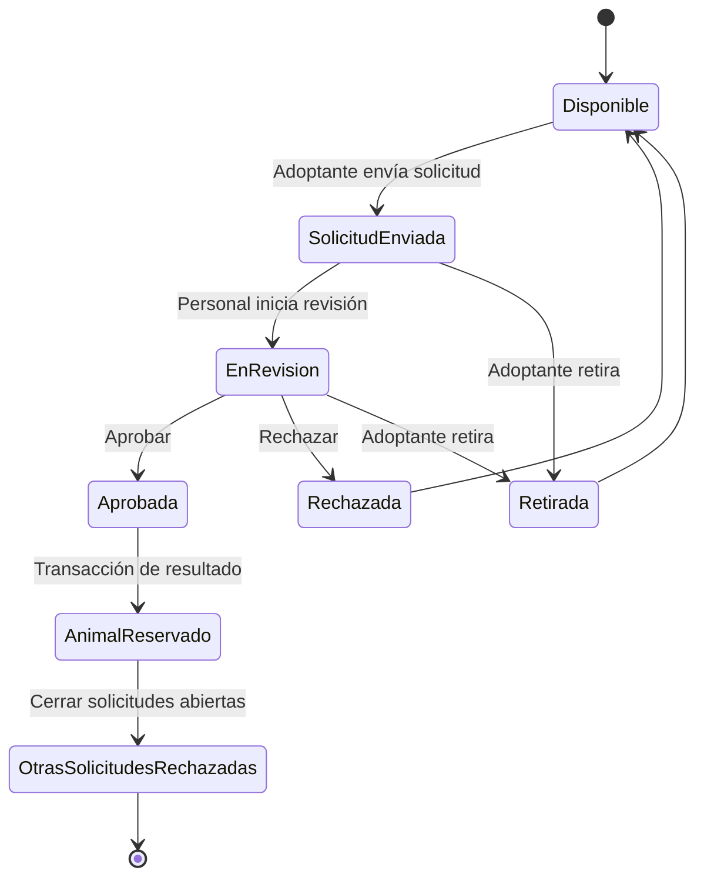
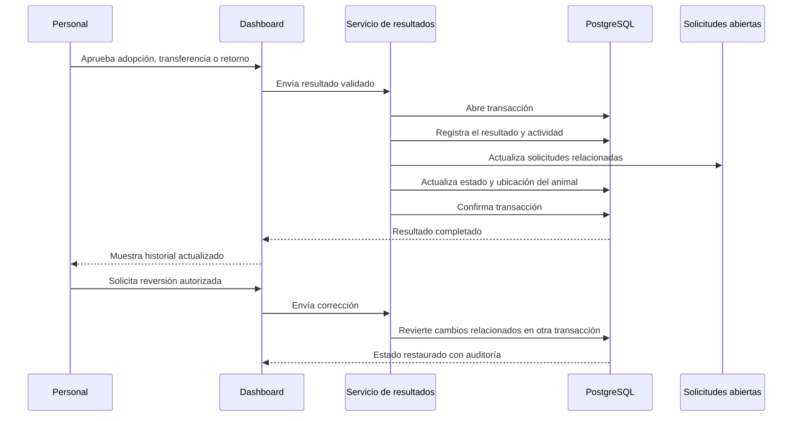
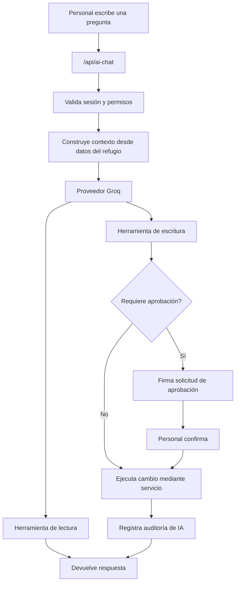
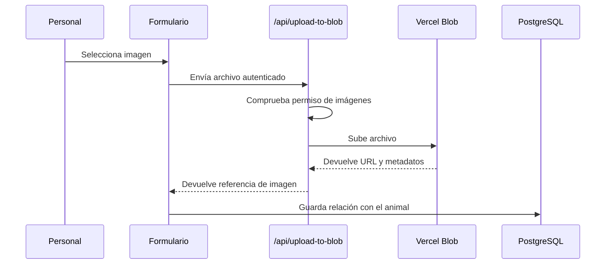

# Flujos principales

## Solicitud web autenticada

```mermaid
sequenceDiagram
    participant U as Usuario
    participant N as Next.js
    participant A as Better Auth
    participant P as Prisma
    participant DB as PostgreSQL

    U->>N: Solicita una página protegida
    N->>A: Lee la sesión
    A->>P: Consulta la sesión y el usuario
    P->>DB: Ejecuta la consulta
    DB-->>P: Devuelve los datos
    P-->>A: Sesión válida o inexistente
    A-->>N: Usuario autenticado
    N->>A: Comprueba rol y permisos
    A-->>N: Acceso permitido o rechazado
    N-->>U: Renderiza dashboard o redirige a login
```

## Ingreso de un animal

```mermaid
flowchart TD
    start([Personal inicia un ingreso])
    form["Completa el formulario"]
    validate["Valida datos con Zod"]
    permission{"Tiene permiso?"}
    service["Servicio de ingreso"]
    transaction["Transacción Prisma"]
    records["Animal + ingreso + actividad"]
    result([Muestra el animal en el dashboard])
    denied([Rechaza la operación])

    start --> form --> validate --> permission
    permission -- No --> denied
    permission -- Sí --> service --> transaction --> records --> result
```

## Solicitud de adopción

```mermaid
stateDiagram-v2
    [*] --> Disponible
    Disponible --> SolicitudEnviada: Adoptante envía solicitud
    SolicitudEnviada --> EnRevision: Personal inicia revisión
    EnRevision --> Aprobada: Aprobar
    EnRevision --> Rechazada: Rechazar
    SolicitudEnviada --> Retirada: Adoptante retira
    EnRevision --> Retirada: Adoptante retira
    Aprobada --> AnimalReservado: Transacción de resultado
    AnimalReservado --> OtrasSolicitudesRechazadas: Cerrar solicitudes abiertas
    OtrasSolicitudesRechazadas --> [*]
    Rechazada --> Disponible
    Retirada --> Disponible
```

## Resultado y reversión

```mermaid
sequenceDiagram
    participant S as Personal
    participant UI as Dashboard
    participant O as Servicio de resultados
    participant DB as PostgreSQL
    participant L as Solicitudes abiertas

    S->>UI: Aprueba adopción, transferencia o retorno
    UI->>O: Envía resultado validado
    O->>DB: Abre transacción
    O->>DB: Registra el resultado y actividad
    O->>L: Actualiza solicitudes relacionadas
    O->>DB: Actualiza estado y ubicación del animal
    O->>DB: Confirma transacción
    DB-->>UI: Resultado completado
    UI-->>S: Muestra historial actualizado

    S->>UI: Solicita reversión autorizada
    UI->>O: Envía corrección
    O->>DB: Revierte cambios relacionados en otra transacción
    DB-->>UI: Estado restaurado con auditoría
```

## Asistente de IA

```mermaid
flowchart TD
    user["Personal escribe una pregunta"]
    route["/api/ai-chat"]
    session["Valida sesión y permisos"]
    context["Construye contexto desde datos del refugio"]
    model["Proveedor Groq"]
    read["Herramienta de lectura"]
    write["Herramienta de escritura"]
    approval{"Requiere aprobación?"}
    sign["Firma solicitud de aprobación"]
    confirm["Personal confirma"]
    execute["Ejecuta cambio mediante servicio"]
    audit["Registra auditoría de IA"]
    response["Devuelve respuesta"]

    user --> route --> session
    session --> context --> model
    model --> read --> response
    model --> write --> approval
    approval -- No --> execute
    approval -- Sí --> sign --> confirm --> execute
    execute --> audit --> response
```

## Subida de imágenes

```mermaid
sequenceDiagram
    participant U as Personal
    participant UI as Formulario
    participant API as /api/upload-to-blob
    participant B as Vercel Blob
    participant DB as PostgreSQL

    U->>UI: Selecciona imagen
    UI->>API: Envía archivo autenticado
    API->>API: Comprueba permiso de imágenes
    API->>B: Sube archivo
    B-->>API: Devuelve URL y metadatos
    API-->>UI: Devuelve referencia de imagen
    UI->>DB: Guarda relación con el animal
```
